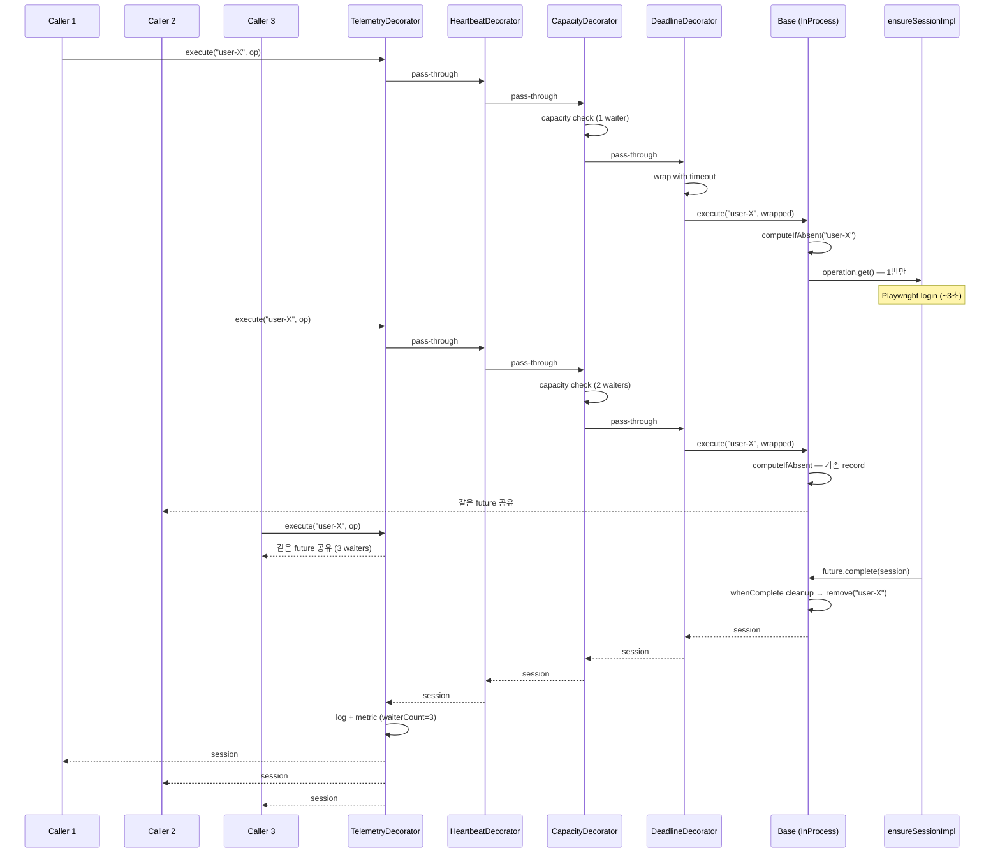

# DESIGN — Hexagonal Architecture + Decorator Stack

> Single-Flight Coordinator 의 architectural 설계. **왜 이 구조인지** + **각 layer 의 책임**.
>
> 코드 구현은 [coordinator-core/](../coordinator-core/) 에서 진행. 결정 근거는 [adr/](adr/).

---

## Architectural Style

**Hexagonal Architecture (Port & Adapter) + Decorator Pattern (GoF)** 의 합성.

### Why this style — 4 시그널 검증

Hexagonal 은 항상 정답이 아님. 다음 4 시그널 중 **2 개 이상** 해당해야 추상화 비용이 정당화.

| 시그널 | 우리 case 적용? |
|---|:---:|
| **여러 backend 가 실제 필요** | ✅ Phase 3 (Redis) 명시 + 미래 MQ routing |
| **도메인 코드 (NaverService) 가 인프라 변경 영향 X** | ✅ Port 만 의존 |
| **Port API 가 안정적** | ✅ 4 메서드 (Phase 1~6 동안 변동 없을 예정) |
| **Framework 독립성** | ✅ coordinator-core 가 Spring 의존성 0 |

**4/4 해당** → Hexagonal 채택 정당화 충분.

### When NOT to use this style

다음 anti-signal 중 2개 이상 해당하면 [Alternative — 단순 utility class](#alternative-simple-utility-30-lines) 가 정답:

| Anti-signal | 우리 case 적용? |
|---|:---:|
| 단일 backend 평생 쓸 가능성 높음 | ❌ |
| Port 가 thin pass-through (변환 / 정책 layer 없음) | ❌ |
| 팀 작고 코드베이스 작고 변경 빈도 낮음 | 부분 |
| Framework 강결합 OK (평생 Spring 만) | ❌ |

→ **0~1 anti-signal 해당.** Hexagonal 의 추상화 비용이 가치 미만 아님.

상세 cost-benefit 분석 + Decision Matrix: [adr/ADR-001-port-adapter-pattern.md](adr/ADR-001-port-adapter-pattern.md#decision-signals--왜-이-case-가-hexagonal-정당화되는가)

### Trade-offs we knowingly accept

이 architectural 선택의 **명시적 비용**:

- ❌ **약 1000 줄 추가** (단순 inline utility 30줄 대비 30× 코드)
- ❌ **추상화 학습 비용** (새 팀원이 chain 이해하는 데 2-3시간)
- ❌ **DI 설정 복잡** (factory 함수에서 5 layer 합성 명시)
- ❌ **간접화 디버깅** (stack trace 가 5 layer 거침)

이 비용을 받아들이는 이유:
- **Phase 3 Redis transition 시 NaverService 수정 0** (절약 ~2일)
- **다른 도메인 (CPEATS, BAEMIN) 재사용** (절약 ~5일/도메인)
- **테스트 격리** (각 layer 독립 디버깅)
- **Portfolio 어필** (architectural depth 시그널)

→ **Phase 3 의 Redis adapter 가 첫 번째 ROI 검증 포인트.** 만약 거기서 Port 시그니처 변경이 필요해지면 추상화 한계 인식하고 ADR-001 revision.

### Alternative — Simple Utility (30 lines)

만약 위 4 시그널이 0~1 개만 해당했다면:

```java
@Service
public class NaverService {
    private final ConcurrentHashMap<String, CompletableFuture<Session>> inflight = new ConcurrentHashMap<>();

    public CompletableFuture<Session> ensureSession(String userId) {
        return inflight.computeIfAbsent(userId, k ->
            doEnsureSession(k).whenComplete((v, e) -> inflight.remove(k))
        );
    }
}
```

이게 **시니어 정답**. YAGNI 정직하게 따름. Hexagonal 자체에 대한 고집은 cargo cult.

상세 결정 근거: [adr/ADR-001-port-adapter-pattern.md](adr/ADR-001-port-adapter-pattern.md)

---

## High-Level Architecture

```mermaid
graph TD
    A[Domain Service<br/>e.g. NaverService.ensureSession]
    B[SingleFlightCoordinator<br/>Port / Interface]
    C[TelemetryDecorator<br/>로그 / 메트릭 / waiter count]
    D[HeartbeatDecorator<br/>60s+ 진행 중 entry 경고]
    E[CapacityDecorator<br/>30+ waiter 거부]
    F[DeadlineDecorator<br/>180s wall-clock 타임아웃]
    G[InProcessSingleFlightCoordinator<br/>ConcurrentHashMap.computeIfAbsent]
    H[ensureSessionImpl<br/>Playwright 영역]

    A -->|depends on Port| B
    B -.->|implements| C
    C -->|inner| D
    D -->|inner| E
    E -->|inner| F
    F -->|inner| G
    G -->|operation()| H

    style A fill:#f9f,stroke:#333,stroke-width:2px
    style B fill:#bbf,stroke:#333,stroke-width:2px,color:#000
    style G fill:#9f9,stroke:#333,stroke-width:2px,color:#000
    style H fill:#fc9,stroke:#333,stroke-width:2px,color:#000
```

**Reading the diagram**:
- 위에서 아래로 호출이 흐름 (delegation)
- 각 layer 가 같은 인터페이스 (`SingleFlightCoordinator`) 구현
- Domain service (NaverService) 는 인터페이스만 의존 → 구현 디테일 invisible
- Backend (InProcess) 가 chain 의 종착점

---

## The Port — `SingleFlightCoordinator`

### Interface

```java
public interface SingleFlightCoordinator {
    /** 동시 호출 시 1 owner + N waiter 로 합침 */
    <T> CompletableFuture<T> execute(
        String key,
        Supplier<CompletableFuture<T>> operation
    );

    /** 옵션 (deadline, maxWaiters, telemetryTag) 포함 버전 */
    <T> CompletableFuture<T> execute(
        String key,
        Supplier<CompletableFuture<T>> operation,
        SingleFlightOptions options
    );

    /** 진행 중 entry snapshot — heartbeat / 운영 도구용 */
    List<InflightEntry> getInflightState();

    /** 운영 kill switch — 강제로 entry 제거 + waiter reject */
    CompletableFuture<Void> forceRelease(String key, String reason);
}
```

### Why This Shape

- **`Supplier<CompletableFuture<T>>`** — operation 을 lazy 하게 평가 (재시도 / 지연 가능)
- **`String key`** — 도메인 의미 (userId, cacheKey, ...) 의 직렬화. 모든 backend 가 string 키 지원
- **`SingleFlightOptions`** — 호출별 정책 override (decorator 가 해석)
- **`getInflightState`** — observability + heartbeat decorator 의 의존
- **`forceRelease`** — 운영 escape hatch (stuck owner 강제 종료)

### What This Port Hides

- 어느 backend 인지 (InProcess / Redis / MQ)
- Lock 메커니즘 (computeIfAbsent / SETNX / per-key queue)
- 결과 전달 방식 (Promise sharing / pub-sub / reply-to)
- Cleanup 전략 (.finally / TTL expire / explicit release)

→ 도메인 service 는 이 모든 디테일에 무관. backend 갈아끼우면 도메인 service 수정 0.

---

## The Base Adapter — `InProcessSingleFlightCoordinator`

### Implementation Sketch

```java
public class InProcessSingleFlightCoordinator implements SingleFlightCoordinator {

    private final ConcurrentHashMap<String, InflightRecord<?>> inflight = new ConcurrentHashMap<>();

    @Override
    public <T> CompletableFuture<T> execute(String key, Supplier<CompletableFuture<T>> operation) {
        @SuppressWarnings("unchecked")
        InflightRecord<T> record = (InflightRecord<T>) inflight.computeIfAbsent(key, k -> {
            CompletableFuture<T> future = operation.get();
            future.whenComplete((v, e) -> inflight.remove(k));
            return new InflightRecord<>(k, future, System.currentTimeMillis());
        });
        return record.future();
    }

    /* getInflightState, forceRelease 생략 */
}

record InflightRecord<T>(String key, CompletableFuture<T> future, long startedAt) {}
```

### Why `ConcurrentHashMap.computeIfAbsent`

- **Atomic**: "없으면 만들고 있으면 반환" 이 하나의 atomic operation
- **No race**: TS 의 `Promise.race + .then(set)` 처럼 race 가능성 없음
- **Cleanup via whenComplete**: future 가 settle 되면 자동 entry 제거
- **Type-safe with cast**: `<T>` 가 generic 이라 cast 1 곳에 격리

### Trade-offs

✅ Latency 0.1ms 미만 (메모리 lookup)
✅ 단순 — JVM 내장 primitive
❌ 단일 process 한정 (멀티 인스턴스 시 cross-instance race)
❌ Process crash 시 모든 inflight 손실 (waiter 들 timeout 으로 fail)

→ 단일 인스턴스 환경의 default. 멀티 인스턴스는 [adr/ADR-002-in-process-vs-redis-lock.md](adr/ADR-002-in-process-vs-redis-lock.md).

---

## The Decorator Stack

각 decorator 는 같은 `SingleFlightCoordinator` 인터페이스 구현. **단일 책임 원칙 (SRP)** 으로 분리.

### Stack Order (inner → outer)

```
Base (InProcess)
  ↓
Deadline    ← hard timeout
  ↓
Capacity    ← waiter cap
  ↓
Heartbeat   ← stuck 감지
  ↓
Telemetry   ← 로그 / 메트릭 (outermost)
```

순서가 의미 있음 — 자세한 근거는 [adr/ADR-003-decorator-stack-order.md](adr/ADR-003-decorator-stack-order.md).

### Decorator 1 — Deadline

**책임**: hard wall-clock 타임아웃. 도달 시 **CompletableFuture 차원에서** owner + 모든 waiter 가 같은 `TimeoutException` 받음.

```java
public class DeadlineDecorator implements SingleFlightCoordinator {
    private final SingleFlightCoordinator inner;
    private final Duration defaultDeadline;

    @Override
    public <T> CompletableFuture<T> execute(String key, Supplier<CompletableFuture<T>> op,
                                             SingleFlightOptions options) {
        Duration deadline = options.deadlineMs()
            .map(Duration::ofMillis)
            .orElse(defaultDeadline);

        return inner.execute(key, () ->
            op.get().orTimeout(deadline.toMillis(), TimeUnit.MILLISECONDS)
        , options);
    }
}
```

**Java 21 의 `CompletableFuture.orTimeout`** — TS 의 `Promise.race(op, timer)` 보다 우아.

#### ⚠️ 중요한 nuance — "Future timeout" vs "실제 작업 cancellation"

`orTimeout` 은 **CompletableFuture 만 timeout** 시킴:
- ✅ 모든 callers (owner + waiter) 가 `TimeoutException` 받음 (예외 전파 정확)
- ✅ Inflight 엔트리는 `whenComplete` cleanup 으로 제거됨
- ❌ **underlying 작업 (Playwright session, Redis call 등) 은 cancel 안 됨**
- ❌ Orphaned 작업이 백그라운드에서 계속 진행 → **자원 leak 위험**

**자원 cleanup 책임 분리**:
- Coordinator 는 future-level 보호만 담당
- 실 작업의 cleanup 은 **operation 본체** 에서 `try-finally` / `whenComplete` / `Cleaner` 로 명시적 처리
- 예: NaverService 의 `ensureSession` 은 timeout 시 `closePage(userId)` 호출하는 finally hook

→ Phase 1 코드에서 이 분리를 명시적으로 시연. ADR-001 의 Implementation Notes 참고.

### Decorator 2 — Capacity

**책임**: 동일 key 의 waiter 수가 cap (default 30) 도달 시 새 호출 즉시 reject.

#### ⚠️ Atomicity 주의 — 두 단계 검사는 race condition

순진한 구현 (race condition 가능):
```java
// ❌ 이건 race 가능
@Override
public <T> CompletableFuture<T> execute(String key, Supplier<CompletableFuture<T>> op,
                                         SingleFlightOptions options) {
    int current = inner.getInflightState().find(key).waiterCount;  // (1) read
    if (current >= max) throw new CongestionException(...);
    return inner.execute(key, op, options);  // (2) attach — 사이에 다른 thread 진입 가능
}
```

(1) read 와 (2) attach 사이에 다른 thread 가 들어오면 cap 31, 32 도 통과 가능.

**올바른 atomic 구현**: capacity 검사를 base record 에 박음.

```java
// ✅ 올바른 방식 — base 의 atomic record 안에 cap check
public class InProcessSingleFlightCoordinator implements SingleFlightCoordinator {
    @Override
    public <T> CompletableFuture<T> execute(String key, Supplier<CompletableFuture<T>> op,
                                             SingleFlightOptions options) {
        int max = options.maxWaiters().orElse(Integer.MAX_VALUE);

        return inflight.compute(key, (k, existing) -> {
            if (existing != null) {
                if (existing.waiterCount.incrementAndGet() > max) {
                    existing.waiterCount.decrementAndGet();
                    throw new CongestionException(key, max, max);
                }
                return existing;
            }
            // 새 owner
            CompletableFuture<T> future = op.get().whenComplete((v, e) -> inflight.remove(k));
            return new InflightRecord<>(k, future, new AtomicInteger(1));
        }).future;
    }
}
```

→ **Capacity 검사가 base record 의 atomic compute 안에서.** Decorator 가 아닌 base 의 책임으로 이동.

**Decorator 의 역할** 은 cap 의 default 값 / option 처리 / telemetry 정도로 한정. 진짜 atomic 검사는 base 가 책임.

→ Phase 1 코드에서 이 atomic 보장을 명시적으로 구현. 단위 테스트의 race scenario 가 검증 포인트.

이 구조의 trade-off:
- ✅ Cap 정확 보장 (race-free)
- ❌ Decorator 의 SRP 살짝 약화 (capacity 가 base 와 결합)
- → ADR-001 의 "When NOT to use" 에서 언급한 "Anti-Signal A2: Port 가 thin pass-through" 로 가는 경향. 실용적 타협.

→ UI spam 방어. 이미 attached waiter 는 영향 없음, 신규 호출만 차단.

### Decorator 3 — Heartbeat

**책임**: `ScheduledExecutorService` 로 15초 간격 스캔. 60초+ 진행 중 entry 발견 시 `long_running` warn 로그.

```java
public void onModuleInit() {
    scheduler.scheduleAtFixedRate(this::scanLongRunning, 15, 15, TimeUnit.SECONDS);
}

private void scanLongRunning() {
    long now = System.currentTimeMillis();
    inner.getInflightState().stream()
        .filter(e -> now - e.startedAt() >= 60_000)
        .forEach(e -> logger.warn("long_running key={} ageMs={}", e.key(), now - e.startedAt()));
}
```

→ 운영자에게 stuck 가능성 사전 알림. Deadline 도달 전에 수동 개입 가능.

### Decorator 4 — Telemetry (outermost)

**책임**: 모든 호출의 로그 + 메트릭. waiter count, owner duration, status (success/failure/deadline/congestion).

```java
@Override
public <T> CompletableFuture<T> execute(String key, Supplier<CompletableFuture<T>> op,
                                         SingleFlightOptions options) {
    String tag = options.telemetryTag().orElse("default");
    long start = System.currentTimeMillis();

    return inner.execute(key, op, options)
        .whenComplete((v, e) -> {
            long duration = System.currentTimeMillis() - start;
            String status = classifyStatus(e);
            metrics.histogram("singleflight_owner_duration_ms",
                Map.of("tag", tag, "status", status), duration);
            logger.info("[SingleFlight] tag={} event=owner_finished status={} key={} durationMs={}",
                tag, status, key, duration);
        });
}
```

**왜 outermost?** Deadline 이 throw 한 `DeadlineExceededException` 을 분류해서 `status=deadline` 으로 메트릭 찍어야 하기 때문. Telemetry 가 안쪽이면 deadline exception 이 보이지 않음.

→ [adr/ADR-003-decorator-stack-order.md](adr/ADR-003-decorator-stack-order.md) 참고.

---

## Sequence Diagram — 동시 N 호출



**핵심 관찰**:
- Operation 은 **1번만 실행** (`Op` 박스)
- 3 caller 모두 같은 `CompletableFuture` 공유
- Cleanup 은 future settle 시 자동 (`whenComplete`)
- Telemetry 가 outermost 라 모든 caller 에 대해 통계 정확

---

## Module Layout

```
single-flight-coordinator-lab/
├── coordinator-core/                    Pure Java 라이브러리
│   └── src/main/java/com/portfolio/singleflight/
│       └── coordinator/
│           ├── SingleFlightCoordinator.java       (Port)
│           ├── SingleFlightOptions.java
│           ├── InflightEntry.java
│           ├── adapter/
│           │   ├── InProcessSingleFlightCoordinator.java
│           │   └── RedisSingleFlightCoordinator.java        (Phase 3)
│           ├── decorator/
│           │   ├── DeadlineDecorator.java
│           │   ├── CapacityDecorator.java
│           │   ├── HeartbeatDecorator.java
│           │   └── TelemetryDecorator.java
│           ├── exception/
│           │   ├── DeadlineExceededException.java
│           │   ├── CongestionException.java
│           │   └── ForceReleasedException.java
│           └── observability/
│               └── MetricSink.java                 (Micrometer 추상화)
│
├── mvc-demo/                            Spring MVC + Tomcat (Phase 2)
├── webflux-demo/                        Spring WebFlux + Reactor (Phase 6)
└── reference/ts-impl/                   TypeScript 참조 구현 (Phase 4)
```

---

## Backend Variants — Future Adapters

### InProcess (Phase 1) — 현재
- 단일 JVM 한정
- `ConcurrentHashMap.computeIfAbsent`

### Redis (Phase 3) — 확장
- 멀티 인스턴스 cross-coalesce
- `SETNX + Lua release + Pub/Sub result broadcast`

### MQ Routing (미래, RFC)
- 인스턴스 간 요청 라우팅 (consistent hash)
- 같은 user 의 요청은 같은 인스턴스로 → 자연스럽게 in-process 로 coalesce
- 단 InProcess Coordinator 와 합성 (대체 아님)

---

## Decorator Pattern — Why GoF over Spring AOP

대안 검토:

### Spring AOP `@Around`
✅ 익숙
✅ Bean 단위 적용
❌ proxy chain 의 디버깅 어려움
❌ Spring 의존성 (coordinator-core 가 Spring 0)
❌ 적용 순서 명시적이지 않음

### Decorator Pattern (우리 선택)
✅ 명시적 stack 순서
✅ Spring 무관 (Pure Java)
✅ 단위 테스트 격리 자연스러움
✅ DI factory 에서 합성 명시

→ coordinator-core 가 framework-independent 라 Pattern 우선.

---

## Failure Modes

각 layer 의 failure 시나리오:

| Failure | 표출 | Recovery |
|---|---|---|
| Operation throws | future fails → all waiters get same exception | InProcess `whenComplete` cleanup, next call 새 owner |
| Deadline exceeded | `DeadlineExceededException` → all waiters fail | InProcess cleanup, next call 새 owner |
| Capacity full | 신규 호출만 `CongestionException`, 기존 waiter 영향 없음 | 기존 owner 끝나면 자동 정상화 |
| InProcess: ownership lost | 거의 불가능 (computeIfAbsent atomic) | — |
| Redis: lock TTL 만료 | 다른 인스턴스가 lock 인수 | TTL 튜닝 |
| Redis: Pub/Sub 누락 | waiter 가 polling fallback | Phase 3 에서 시연 |
| forceRelease called | `ForceReleasedException` to all waiters | 운영 escape hatch |

---

## Performance Characteristics

| Operation | Time | Notes |
|---|---|---|
| `execute` first call | 1 microtask + computeIfAbsent | ~1μs overhead |
| `execute` waiter (already inflight) | 1 computeIfAbsent | ~0.5μs overhead |
| `getInflightState` | O(n) scan | n = inflight entries (보통 < 100) |
| `forceRelease` | O(1) | atomic remove |
| Heartbeat scan | O(n), 15s 간격 | n 작으니 무시 |

→ Coalescing 자체의 overhead 는 micro-second. 비싼 외부 호출 (밀리초~초) 대비 무시 가능.

---

## Related

- [STORY.md](STORY.md) — 전체 narrative
- [INCIDENT.md](INCIDENT.md) — 이 설계가 풀어야 했던 incident
- [BENCHMARK.md](BENCHMARK.md) — 측정 방법론 + 결과
- [adr/ADR-001-port-adapter-pattern.md](adr/ADR-001-port-adapter-pattern.md) — Port/Adapter 채택 근거
- [adr/ADR-002-in-process-vs-redis-lock.md](adr/ADR-002-in-process-vs-redis-lock.md) — Backend 선택 근거
- [adr/ADR-003-decorator-stack-order.md](adr/ADR-003-decorator-stack-order.md) — Decorator 순서 근거
- [adr/ADR-004-coordinator-vs-caffeine.md](adr/ADR-004-coordinator-vs-caffeine.md) — 직접 구현 vs Caffeine 비교
- [adr/ADR-005-reactive-vs-sync-coalescing.md](adr/ADR-005-reactive-vs-sync-coalescing.md) — Reactive 적응 (Phase 6)
